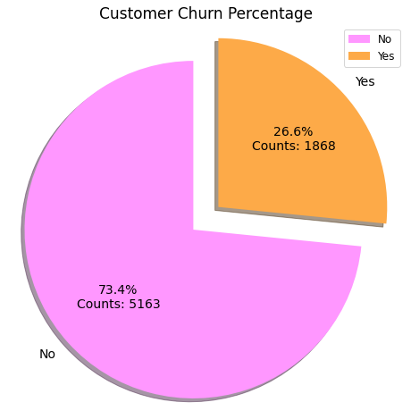

# Customer Churn Prediction Project

## Overview
Customer churn, the phenomenon of customers leaving a service or product, can significantly impact a business's revenue and growth. This project focuses on predicting customer churn using machine learning techniques, helping businesses identify potential churners early and take actions to retain them.

## Table of Contents
- [Project Highlights](#project-highlights)
- [Technologies Used](#technologies-used)
- [Usage](#usage)
- [Contributing](#contributing)
- [Contact](#contact)
- [Status](#status)

## Project Highlights
- **Dataset**: Utilized a real-world customer dataset containing few features like:

| Features          | Description                                       |
| ----------------- | ------------------------------------------------- |
| customerID        | Unique ID for each customer                       |
| gender            | Gender of the customer                            |
| SeniorCitizen     | Whether the customer is a senior citizen (1: Yes, 0: No) |
| Partner           | Whether the customer has a partner (Yes/No)      |
| Dependents        | Whether the customer has dependents (Yes/No)     |
| tenure            | Number of months the customer has been with the company |
| PaymentMethod     | Payment method used by the customer                |
| MonthlyCharges    | Monthly charges for the services                   |
| TotalCharges      | Total charges paid by the customer                 |
| Churn             | Whether the customer churned (Yes/No)              |

And many more features...

- **Exploratory Data Analysis (EDA)**: Explored the data to gain insights into customer behavior and churn patterns.

  
- **Data Preprocessing**: Cleaned and transformed the data, addressing missing values and encoding categorical features.
- **Model Selection**: Evaluated multiple machine learning algorithms, including Logistic Regression, SVM, Decision Tree, and Random Forest.

  | **Models** |
  | ------ |
  | [Logistic Regression](https://scikit-learn.org/stable/modules/generated/sklearn.linear_model.LogisticRegression.html) |
  | [GaussianNB](https://scikit-learn.org/stable/modules/generated/sklearn.naive_bayes.GaussianNB.html) |
  | [SVC (Support Vector Classification)](https://scikit-learn.org/stable/modules/generated/sklearn.svm.SVC.html) |
  | [Decision Tree Classification](https://scikit-learn.org/stable/modules/generated/sklearn.tree.DecisionTreeClassifier.html) |
  | [Random Forest Classification](https://scikit-learn.org/stable/modules/generated/sklearn.ensemble.RandomForestClassifier.html) |
- **Hyperparameter Tuning**: Employed GridSearchCV and RandomizedSearchCV to optimize model hyperparameters.
- **Model Evaluation**: Used various metrics such as accuracy, precision, recall, F1-score, and AUC-ROC to assess model performance.
- **Visualization**: Visualized the ROC curve and feature importance to aid interpretation.

## Technologies Used
- Python
- scikit-learn
- pandas
- numpy
- matplotlib
- seaborn
- Jupyter Notebook

## Usage
1. Open the Jupyter Notebook `customer-churn-prediction.ipynb`.
2. Follow along with the step-by-step implementation and analysis.
3. Experiment with different models, hyperparameters, and techniques.
4. Modify the code to apply the project to your own dataset.

## Contributing
Contributions are welcome! If you have suggestions or improvements, please create an issue or submit a pull request.

## Contact
For feedback or question, contact me:
- [Dibyansu Singh](mailto:ricky1132003singh@gmail.com)
- [LinkedIn](https://www.linkedin.com/in/dibyansu-singh-131930257/)
- [GitHub](https://github.com/dibyansu06/)

## Status
30/08/2023 - Completed
